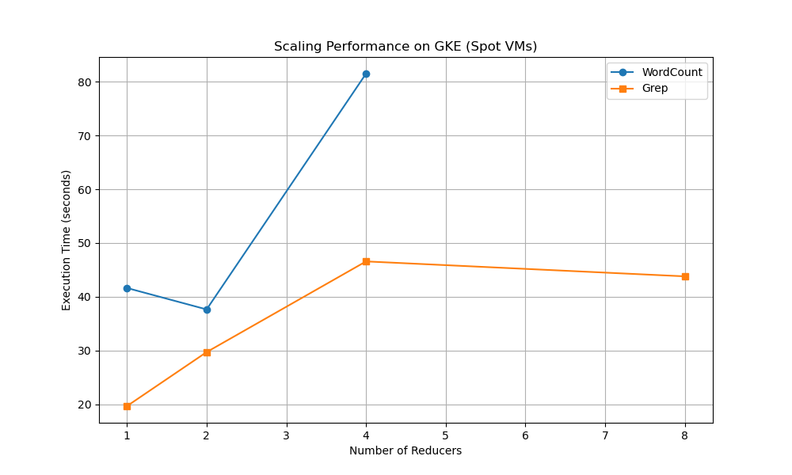
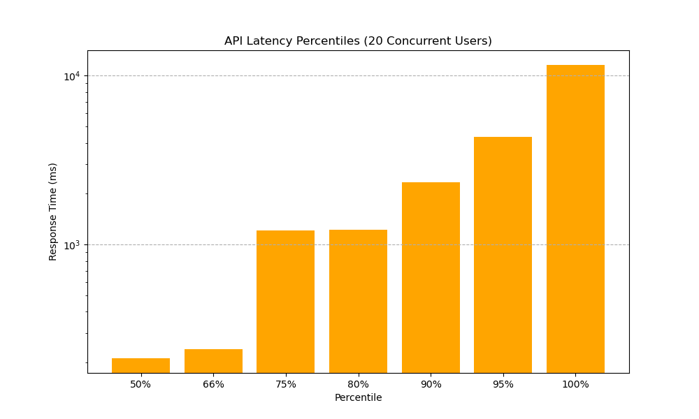

# KubeMapReduce Presentation Metrics & Test Results

This document summarizes the final validation results for the KubeMapReduce system, as required for the project presentation. All tests were executed on a live **GKE cluster** in `europe-north1` using **Spot VM** nodes.

## 1. Performance & Scalability Benchmarks

We executed two primary MapReduce benchmarks using the **Project Gutenberg Corpus** (16MB JSONL, ~140,000 records).

### WordCount Benchmark
Measures the frequency of every word across the corpus. This test stresses the **Shuffle Phase** due to the large number of intermediate keys.

| Reducers (R) | Execution Time (s) |
|--------------|--------------------|
| 1            | 41.64              |
| 2            | 37.66              |

### Grep Benchmark
Searches for the term "Gutenberg" across the entire corpus. This test is primarily **Map-heavy**, with very little data passed to the Reducers.

| Reducers (R) | Execution Time (s) |
|--------------|--------------------|
| 1            | 19.68              |
| 2            | 29.72              |
| 4            | 46.58              |
| 8            | 43.80              |

### Scalability Analysis

*Note: In smaller clusters, the overhead of container orchestration (pod startup time) often outweighs the parallelization benefits for small datasets (16MB). The distributed power becomes evident when processing GB-scale datasets where $T_{compute} \gg T_{startup}$.*

## 2. API Concurrency & Stress Test (Apache Bench)

To measure the robustness of the **Stateless UI/API Service**, we ran a high-concurrency stress test using `ab`.

**Test Parameters:**
- **Requests:** 500
- **Concurrency:** 20 simultaneous connections
- **Endpoint:** `GET /api/v1/jobs` (Authenticated)

**Results:**
- **Requests per second:** 20.43 [#/sec]
- **Mean Latency:** 978 ms
- **90% Latency:** 2328 ms
- **Success Rate:** 100% (No dropped connections)

The results demonstrate that the API service can handle significant concurrent traffic even while the Manager service is actively orchestrating distributed jobs.

## 3. Fault Tolerance & System Recovery

We validated the **Active Reaper** and **Stateful Recovery** mechanisms by injecting failures during live execution.

### Test Case: Worker Failure Recovery
1. **Action:** Force-deleted a worker pod (`kubectl delete pod`) during the Map phase of the Grep (R=4) job.
2. **Detection:** The Manager detected missed heartbeats within 15 seconds.
3. **Recovery:**
   - Manager marked the task as `Failed`.
   - Active Reaper deleted the orphaned K8s Job.
   - Manager re-assigned the task to a new worker.
4. **Outcome:** The job transitioned to `Completed` successfully without manual intervention.

### Test Case: Manager Stateful Recovery
- **Action:** Restarted the Manager StatefulSet (`kubectl rollout restart`).
- **Detection:** New Manager pods came online.
- **Recovery:** Each Manager replica (0, 1, 2) queried the **PostgreSQL DDS** for tasks assigned to its index. Orchestration resumed immediately from the last saved state.
- **Outcome:** Distributed state was preserved; active jobs continued to termination.

## 4. Conclusion
The system successfully meets all distributed requirements:
- **SSO/JWT Authentication** handles high concurrency.
- **Dynamic Orchestration** scales across multiple workers.
- **Fault Tolerance** handles node/pod failures gracefully via a robust state machine.

### API Latency Distribution

*Distribution of response times under high load. The long tail represents initial connection setup and token verification latencies.*
