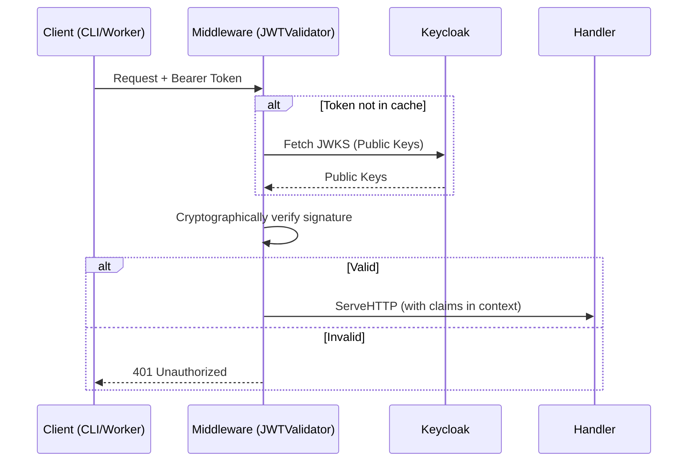

# auth

> Centralized authentication and authorization primitives.

## Why This Package Exists
KubeMapReduce is a distributed platform where various components (CLI, Manager, Workers) must interact securely. This package provides the "glue" to Keycloak, ensuring that every request is backed by a cryptographically verified identity. Without this package, the system would be vulnerable to unauthorized job submissions or, worse, "zombie" workers interfering with valid tasks.

## Architecture


## Key Concepts
- **Stateless Verification**: By using JWTs and caching Keycloak's public keys, services can verify tokens locally without hitting the database or identity provider on every request.
- **Thundering Herd Protection**: The `KeycloakAdminClient` uses a `sync.Cond` to ensure that if the administrative token expires, only one goroutine refreshes it while others wait, preventing an API storm on Keycloak.
- **Lease-Based Fencing**: Although handled at the protocol level, this package provides the JWT primitives used to carry the `worker_id` and other claims used for fencing.

## Exported API

| Name | Signature | Description |
|---|---|---|
| `JWTValidator` | `struct` | Manages JWKS caching and token validation. |
| `Middleware` | `func (v *JWTValidator) Middleware(next http.Handler) http.Handler` | Validates Bearer tokens and injects claims into context. |
| `KeycloakAdminClient` | `struct` | High-level client for managing users and roles. |
| `GetRoles` | `func(r *http.Request) ([]string, error)` | Extracts Keycloak realm roles from the request context. |
| `RequireRole` | `func(role string, v *JWTValidator, next http.Handler) http.Handler` | Middleware that enforces a specific realm role. |

## Error Catalogue
| Error | Meaning |
|---|---|
| `ServiceUnavailableError` | Keycloak is unreachable or returned a 5xx error. |
| `ErrMalformedRoles` | The JWT claims do not contain a valid role list structure. |

## Example Usage
```go
validator, _ := auth.NewJWTValidator("https://keycloak/jwks", "issuer", "audience")
mux := http.NewServeMux()

// Protect an endpoint with the ADMIN role
handler := auth.RequireRole("ADMIN", validator, http.HandlerFunc(myAdminHandler))
mux.Handle("/admin", handler)
```
