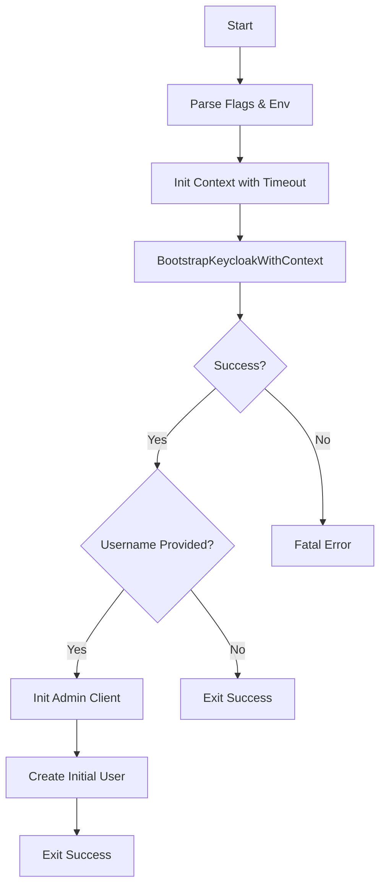

# Keycloak Setup Utility Entry Point

> Bootstraps the KubeMapReduce identity provider (Keycloak).

## Why This Package Exists
The `cmd/setup` package is a one-time utility designed to automate the configuration of Keycloak. It ensures that the required realm, roles, and OIDC client exist before any other service tries to validate tokens or manage users.

## Architecture

## Key Concepts

### Idempotency
The setup process is idempotent. If the realm or client already exists, the tool will update their configuration to match the expected state rather than failing. This makes it safe to run as an `initContainer` or a repeating Kubernetes Job.

### Realm Configuration
The tool creates a specialized realm (default: `mapreduce`) with:
- **OIDC Client**: Configured for both the CLI (implicit flow) and the API (service accounts).
- **Audience Mapper**: Ensures the `aud` claim in the JWT matches the expected `mapreduce-api` identifier.
- **Roles**: Defines `ADMIN` and `USER` roles which are used by the API for authorization.

## Exported API
This utility is controlled via command-line flags:

| Flag | Env Var | Description |
|---|---|---|
| `--keycloak-base-url` | `KEYCLOAK_BASE_URL` | Location of the Keycloak server |
| `--realm` | `KEYCLOAK_REALM` | The realm to create/update |
| `--username` | - | Optional user to create after bootstrap |
| `--prompt-password` | - | Securely prompt for the new user's password |

## Error Catalogue
| Error | When |
|---|---|
| `bootstrap failed` | Keycloak is unreachable or admin credentials are wrong |
| `failed to read password` | Terminal input error during `--prompt-password` |
| `invalid --role` | Provided role was not `ADMIN` or `USER` |
