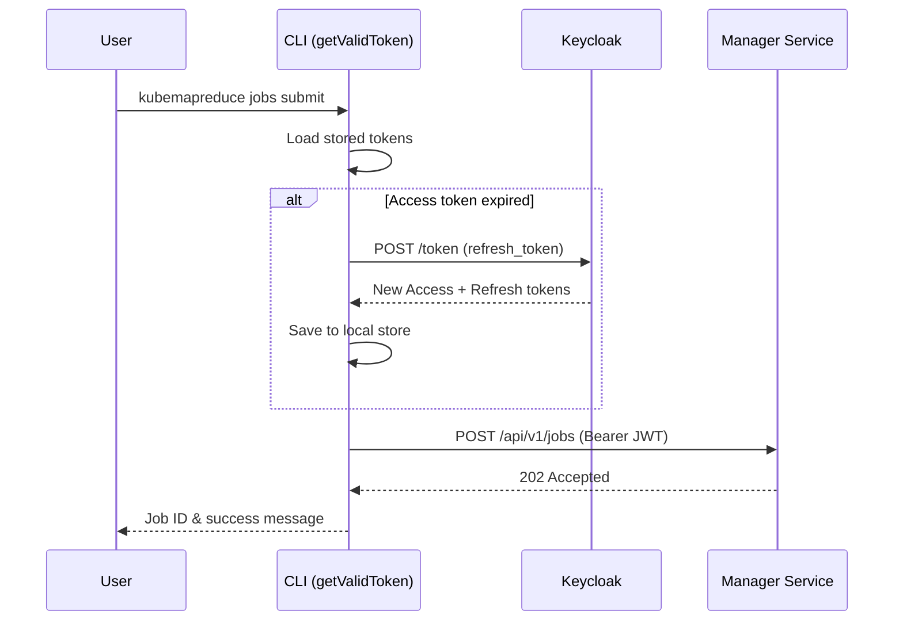

# CLI (Command Line Interface)

> The KubeMapReduce CLI is the primary user-facing tool for job submission, monitoring, and administration.

## Why This Package Exists
The `cli-service/cmd/cli` package provides a stateless, developer-friendly interface to the KubeMapReduce platform. It abstracts the complexities of direct REST API interaction and handles the complete authentication lifecycle (JWT acquisition, storage, and transparent refresh). By providing a CLI, the system enables easy integration into CI/CD pipelines and developer workflows while ensuring that all business logic and security constraints remain centralized in the Manager Service.

## Architecture
The CLI follows a "thin client" architecture, where most commands are simple wrappers around authenticated REST calls. The core logic resides in the token management system, which ensures a valid JWT is always present before a request is made.



## Key Concepts

### Token Lifecycle Management
The CLI owns the authentication state for the user. It stores JWTs in a local configuration file (typically `~/.kubemapreduce/tokens.json`). Before every authenticated request, `getValidToken()` checks if the access token is still valid. If it has expired, it uses the refresh token to obtain a new session from Keycloak without interrupting the user's workflow.

### Metadata-Only Submission
Job submission in KubeMapReduce is designed to be efficient. The `jobs submit` command does not upload large data files or binaries. Instead, it submits a JSON specification (metadata) that points to where the mapper, reducer, and input data are located within the shared storage (e.g., MinIO). This prevents the CLI from becoming a bottleneck for large datasets.

### Fail-Fast Execution
The CLI is designed for interactive and automated use. It uses "fail-fast" patterns (via `doAuthRequestExpect`) to immediately terminate execution and provide a non-zero exit code if the API returns an error or an unexpected status code. This ensures that scripts calling the CLI can accurately detect and respond to failures.

## Exported API
*Note: As this is a `main` package, most functions are unexported. The following are the key command entry points.*

| Function | Purpose |
|---|---|
| `cmdLogin` | Authenticates user and initializes the local token store. |
| `cmdJobsSubmit` | Validates job flags and submits metadata to `/jobs`. |
| `cmdJobsStatus` | Retrieves and displays the current state of a specific job. |
| `cmdJobsDownload` | Streams job results from the API to a local file. |
| `getValidToken` | Ensures a valid JWT is available, performing refresh if needed. |

## Error Catalogue

| Error Message | Meaning | Resolution |
|---|---|---|
| `Run 'kubemapreduce login' first` | No stored tokens found. | Execute `kubemapreduce login`. |
| `session expired, please login again` | Refresh token is also expired or revoked. | Execute `kubemapreduce login` to re-authenticate. |
| `job download failed: server returned 404` | The requested Job ID does not exist. | Verify the Job ID with `kubemapreduce jobs list`. |
| `unsupported URL scheme` | The `API_URL` is not http or https. | Check the `API_URL` environment variable. |
| `response body exceeds X bytes` | The API returned a response larger than the 4MB safety limit. | Check if the request is correctly scoped (e.g., list limit). |

## Example Usage

### Submitting a Job
```bash
# Set the API location if not running on localhost
export API_URL="http://api.mapreduce.internal"

# Login to the cluster
kubemapreduce login --username k.viking

# Submit a word count job
kubemapreduce jobs submit \
  --mapper ./wordcount_mapper.py \
  --reducer ./wordcount_reducer.py \
  --input s3://data/large_text_file.txt \
  --reducers 5
```

### Checking Status
```bash
kubemapreduce jobs status --id 550e8400-e29b-41d4-a716-446655440000
```
