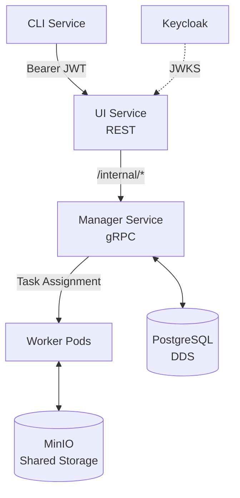

# KubeMapReduce

> Distributed MapReduce platform — INF-419, Technical University of Crete  
> Supervisor: Prof. Vasilios Samoladas

A microservice-based MapReduce platform deployed on Kubernetes, built for fault tolerance and horizontal scalability.

## Architecture

## Services

| Service                                                  | Role                                           |
| -------------------------------------------------------- | ---------------------------------------------- |
| [CLI Service](cli-service/cli/README.md)                 | User-facing CLI; owns all token refresh logic  |
| [Manager — API](manager-service/api/README.md)           | HTTP handlers, JWT middleware, job lifecycle   |
| [Manager — Scheduler](manager-service/manager/README.md) | Scheduling, lease management, Active Reaper    |
| [Manager — Models](manager-service/models/README.md)     | DDS structs and status enumerations            |
| [Auth Service](auth-service/auth/README.md)              | JWT validation, Keycloak helpers, JWKS refresh |

## API Reference

- [REST API](api/rest.md) — Public-facing UI Service endpoints
- [gRPC API](api/grpc.md) — Internal Manager ↔ Worker contract
