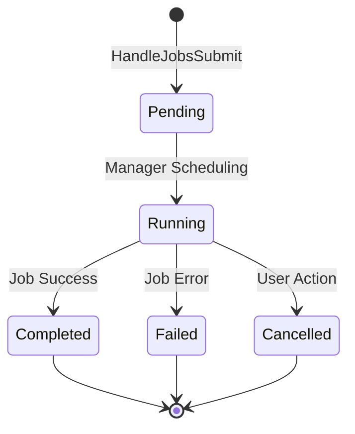

# Manager Service API

> The entry point for all job management and cluster administration.

## Why This Package Exists
The `manager-service/internal/api` package provides the external REST interface to the KubeMapReduce platform. It acts as a gateway that translates user intents (e.g., "start a job", "list active work") into actions within the cluster. By centralizing all user-facing interactions here, the system enforces uniform security policies (JWT validation) and ensures that all job metadata is consistently persisted to the DDS before execution begins.

## Architecture
The API layer is built as a set of stateless HTTP handlers that communicate with a pluggable [JobStore]. This design allows the API to scale independently of the job processing logic.



## Key Concepts

### Metadata Persistence (JobStore)
The [JobStore] interface is the system's way of ensuring "at least once" visibility of a job. When a job is submitted via `HandleJobsSubmit`, the API ensures it is written to the DDS (PostgreSQL in production) within a transaction. This creates the "system of record" that the background scheduler then uses to create worker pods.

### Role-Based Access Control (RBAC)
The API leverages the `auth-service/pkg/auth` package to enforce RBAC. Most job-related endpoints are available to both `USER` and `ADMIN` roles, while configuration and user-management endpoints are restricted strictly to `ADMIN` users. This enforcement happens at the routing layer before any handler logic is executed.

### Paginated Job History
To prevent the API from becoming a performance bottleneck, the `HandleJobsList` endpoint uses mandatory pagination. This protects the system memory when thousands of historical jobs exist in the DDS.

## Exported API

| Type/Function | Signature | Description |
|---|---|---|
| `Handlers` | `struct` | Owns all API endpoint implementations and injected dependencies. |
| `NewHandlers` | `func(adminClient, store) *Handlers` | Factory for creating production-ready handler instances. |
| `RegisterRoutes` | `func(mux, handlers, validator)` | Configures all HTTP patterns and attaches RBAC middleware. |
| `JobStore` | `interface` | Defines the contract for persisting and searching job metadata. |
| `PostgresJobStore` | `struct` | DDS-backed implementation of [JobStore] used in production. |

## Error Catalogue

| Error Message | Status | Meaning |
|---|---|---|
| `invalid job id` | 400 | The provided UUID was malformed. |
| `job not found` | 404 | The requested job ID does not exist in the store. |
| `failed to persist job` | 500 | An error occurred while writing to the DDS (e.g., DB down). |
| `request payload too large` | 413 | The submitted job spec exceeds the 1MB limit. |
| `authentication service unavailable` | 503 | Keycloak is unreachable for admin operations. |

## Example Usage

### Manual Handler Initialization (Testing)
```go
// Create an in-memory store for isolation
store := api.NewMemoryJobStore(1*time.Hour, 100, nil)
handlers := api.NewHandlers(nil, store)

// Manually call a handler (e.g., for a unit test)
w := httptest.NewRecorder()
r := httptest.NewRequest("GET", "/jobs", nil)
handlers.HandleJobsList(w, r)
```
