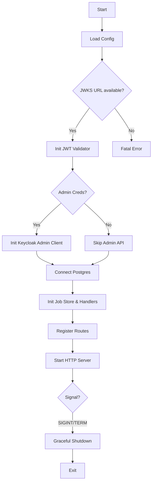

# UI Service API Entry Point

> Bootstraps the user-facing REST API for the KubeMapReduce platform.

## Why This Package Exists
The `cmd/api` package is the entry point for the UI Service. It is responsible for initializing the HTTP server, configuring security via Keycloak, and connecting to the job metadata store. This service acts as the gateway for all user and CLI interactions with the platform.

## Architecture

## Key Concepts

### JWT Validation
Every incoming request (except for basic health checks) must carry a valid RS256 JWT from the configured Keycloak realm. The validator fetches the public keys from the JWKS endpoint during startup.

### Graceful Shutdown
The service uses `signal.NotifyContext` to catch termination signals. It allows up to 15 seconds for in-flight HTTP requests to complete before closing the process, ensuring no partial data is left in the job store during deployments.

## Exported API
As a `main` package, it does not export Go identifiers for external use. It "exports" the following HTTP API structure:

| Route | Auth | Description |
|---|---|---|
| `/api/v1/jobs` | JWT (Bearer) | Submit or query MapReduce jobs |
| `/admin/*` | JWT (ADMIN role) | User and realm management (requires Admin Client) |
| `/health` | None | Service liveness probe |

## Error Catalogue
| Error | When |
|---|---|
| `failed to initialize JWT validator` | Keycloak is unreachable or the realm doesn't exist |
| `failed to open database` | PostgreSQL DSN is invalid |
| `server failed` | Port is already in use or OS-level error |
