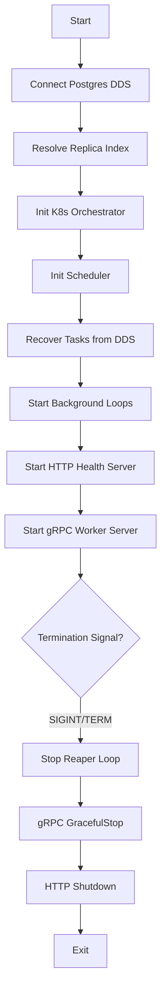

# MapReduce Manager Entry Point

> Bootstraps the platform's brain: the Manager Service.

## Why This Package Exists
The `cmd/manager` package is the entry point for the MapReduce Manager. It coordinates the complex initialization of the Scheduler, Kubernetes orchestrator, and multiple server interfaces (gRPC for Workers and HTTP for health/internal control).

## Architecture

## Key Concepts

### StatefulSet Identity
The Manager resolves its `replicaIndex` from the pod hostname (e.g., `manager-0`). This index is critical for deterministic task partitioning, ensuring that each Manager replica handles a disjoint set of MapReduce jobs.

### Active Reaper
Once initialized, the Manager starts a background "Reaper" loop. Every 10 seconds, it scans the database for task attempts whose leases have expired and automatically fails them, triggering a retry in the scheduler.

### Worker Authentication
The gRPC server uses a `workerAuthUnaryInterceptor` to validate a static `x-worker-token` on every request from Worker pods. For production environments, it also supports mutual TLS.

## Exported API
As a `main` package, it "exports" the following interfaces:

### gRPC (WorkerService)
| Method | Description |
|---|---|
| `Register` | Worker pod identifies itself and claims a task |
| `Heartbeat` | Worker pod extends its task lease |
| `TaskComplete` | Worker signals successful processing |
| `TaskFailed` | Worker signals error and provides stack trace |

### HTTP (Internal Control)
| Route | Auth | Description |
|---|---|---|
| `DELETE /internal/jobs/{id}` | Internal Token | Force-cancel a running job |
| `/health` | None | Liveness probe |
| `/ready` | None | Readiness probe (checks DB) |

## Error Catalogue
| Error | When |
|---|---|
| `failed to recover scheduler` | Database corruption or network loss during startup |
| `insecure worker RPC config` | Running without TLS or token auth when disallowed |
| `failed to create k8s clientset` | Missing in-cluster RBAC permissions |
