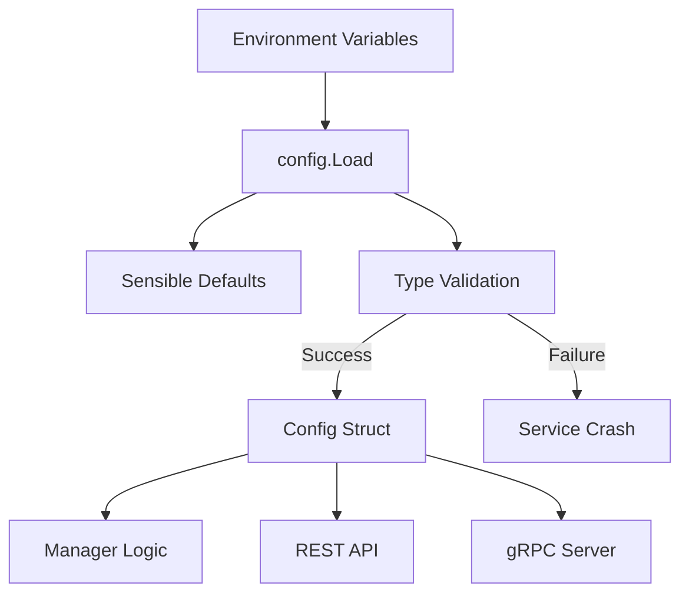

# config

> Environment-driven configuration and service bootstrapping.

## Why This Package Exists
The `config` package provides the "glue" between the Kubernetes environment and the Manager Service's internal logic. By centralizing all external dependencies (Keycloak, Postgres, MinIO) and system tunables (Lease TTL, Heartbeat intervals) in a single, typed struct, the package ensures that the service starts with a valid and consistent view of its environment.

## Architecture


## Key Concepts

### 12-Factor Methodology
The package follows the 12-factor app principle of "Config in the environment." It avoids configuration files in favor of environment variables, which are injected via Kubernetes ConfigMaps and Secrets.

### Calculated Tunables
Some configuration fields, such as `LeaseTTL`, are not sourced directly from the environment. Instead, they are calculated from other values (e.g., `HeartbeatInterval * MaxMissedHeartbeats`) to ensure internal consistency across the system's failure detection logic.

## Exported API

| Type/Func | Description |
|---|---|
| `Config` | Central struct holding all typed configuration data. |
| `Load()` | Populates the `Config` struct from environment variables. |

## Error Catalogue

| Error | Meaning |
|---|---|
| `invalid integer for <KEY>` | The environment variable expected a number but received a string. |

## Example Usage
```go
import "KubeMapReduce/manager-service/internal/config"

cfg, err := config.Load()
if err != nil {
    log.Fatalf("failed to load config: %v", err)
}

fmt.Printf("Starting gRPC server on %s\n", cfg.GRPCAddr)
```
