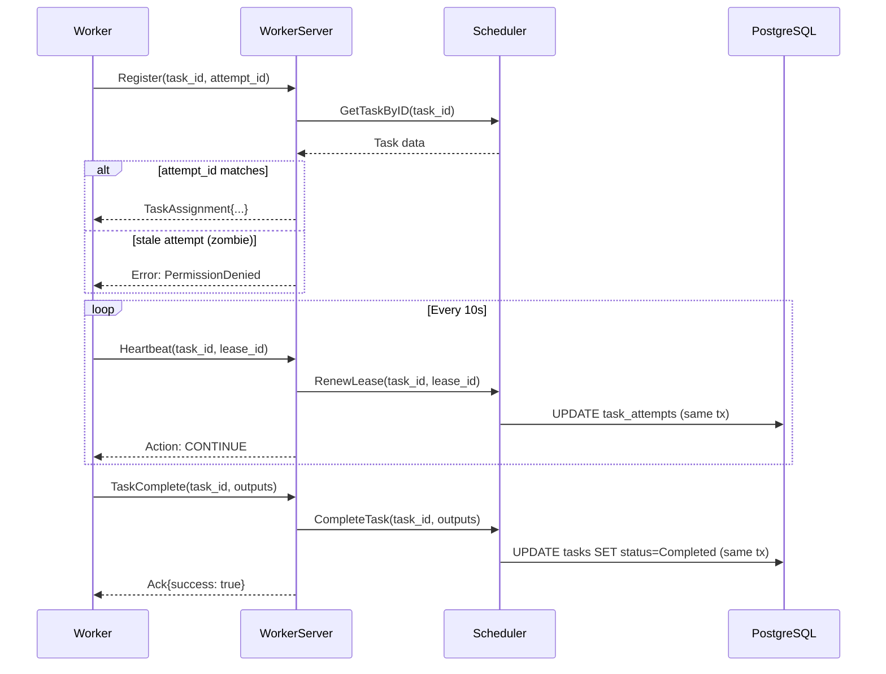

# grpc

> The primary gRPC interface for Worker communication.

## Why This Package Exists
The `grpc` package is the entrypoint for all distributed computation in the KubeMapReduce system. It provides the high-performance, strongly-typed API that Workers use to claim tasks, maintain leases via heartbeats, and report their final output. It abstracts the complexities of gRPC's transport layer from the core scheduling logic.

## Architecture


## Key Concepts

### Manifest Fallback
gRPC has a default message size limit (typically 4MB). If a `TaskAssignment` contains thousands of input splits, it could exceed this limit. The `WorkerServer` automatically detects this, serializes the locations to a JSON file in MinIO (the "manifest"), and returns the manifest's URL to the worker instead.

### Zombie Worker Fencing
The `Register`, `Heartbeat`, and `TaskComplete` methods all perform validation against the `attempt_id` and `lease_id`. This ensures that even if a worker "comes back from the dead" (e.g., after a long GC pause), it cannot commit results if the Manager has already reassigned its task to another worker.

## Exported API

| Type/Func | Signature | Description |
|---|---|---|
| `NewWorkerServer` | `(scheduler, minioClient) *WorkerServer` | Creates a new gRPC server instance with manifest support. |
| `Register` | `(ctx, RegisterRequest) (*TaskAssignment, error)` | Claims a task for a worker. |
| `Heartbeat` | `(ctx, HeartbeatRequest) (*HeartbeatResponse, error)` | Renews a task lease. |
| `TaskComplete` | `(ctx, TaskCompleteRequest) (*Ack, error)` | Commits task results to the DDS. |
| `TaskFailed` | `(ctx, TaskFailedRequest) (*Ack, error)` | Reports a task failure. |

## Error Catalogue

| gRPC Code | Meaning |
|---|---|
| `InvalidArgument` | Missing required field (e.g., `task_id`). |
| `NotFound` | The requested task does not exist in the DDS. |
| `PermissionDenied` | The `attempt_id` or `lease_id` is stale (zombie fencing). |
| `ResourceExhausted` | The task assignment is too large even after manifest fallback. |

## Example Usage
```go
import (
    "google.golang.org/grpc"
    mgrgrpc "KubeMapReduce/manager-service/internal/grpc"
)

// ... setup scheduler and minio client ...

s := grpc.NewServer()
workerSrv := mgrgrpc.NewWorkerServer(scheduler, minioClient)
pb.RegisterWorkerServiceServer(s, workerSrv)

log.Printf("server listening at %v", lis.Addr())
if err := s.Serve(lis); err != nil {
    log.Fatalf("failed to serve: %v", err)
}
```
