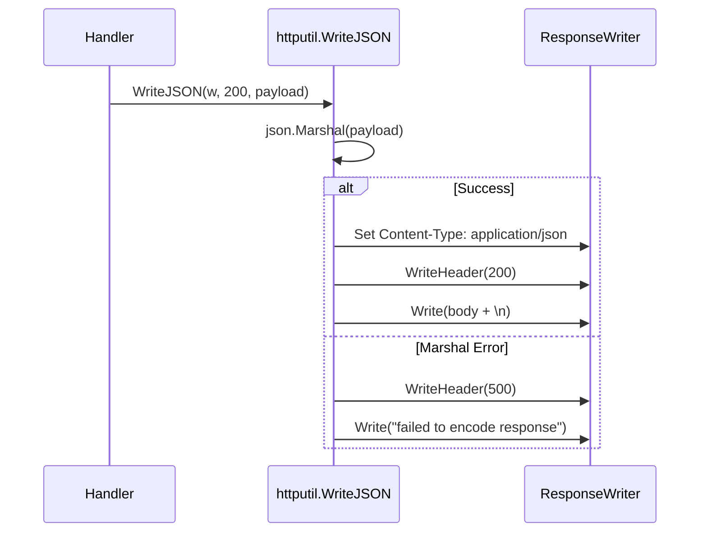

# HTTP Utilities

> Standardization of RESTful responses.

## Why This Package Exists
In a system with dozens of API endpoints, inconsistency in response headers, status codes, or payload formats leads to brittle clients. The `httputil` package ensures that every HTTP response from the `manager-service` follows the same "look and feel."

## Architecture
This package provides a simple wrapper around the standard `net/http` library.



## Key Concepts

### JSON-First Communication
All structured data returned by the system is JSON. This simplifies integration with the CLI and any future web dashboards.

### CLI Friendliness
By appending `\n` to every JSON response, the utilities ensure that users running `curl` in their terminal get a clean prompt on the next line, rather than having the JSON blob merged with their shell prompt.

## Exported API

### `WriteJSON(w http.ResponseWriter, status int, payload any) error`
The workhorse function for the UI Service. It handles content negotiation (fixing it to JSON), status code setting, and serialization in one call.

### `WriteErrorJSON(w http.ResponseWriter, status int, message string)`
Sends a structured JSON error response following the standard error contract `{"error": "...", "code": 400}`.

## Error Catalogue

| Error | Meaning | Recovery |
|---|---|---|
| `failed to encode response` | The Go struct could not be marshaled to JSON (e.g., recursive reference). | This is a developer error; check the struct tags and types. |

## Example Usage

```go
func MyHandler(w http.ResponseWriter, r *http.Request) {
    data := GetSomeData()
    if err := httputil.WriteJSON(w, http.StatusOK, data); err != nil {
        log.Printf("Failed to write response: %v", err)
    }
}
```
