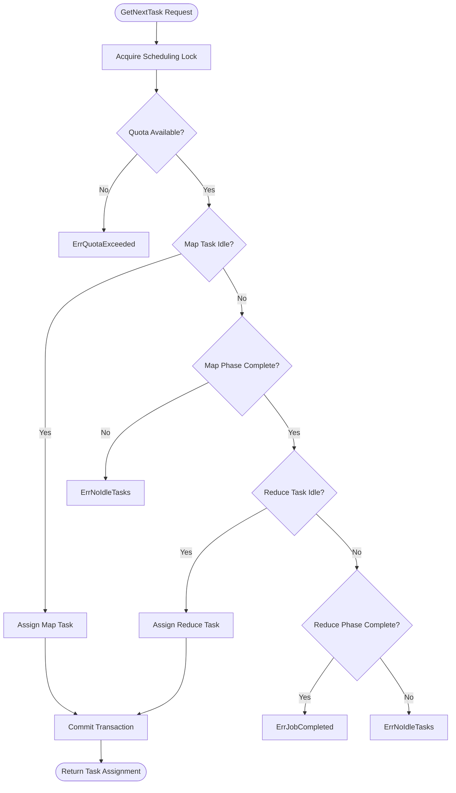
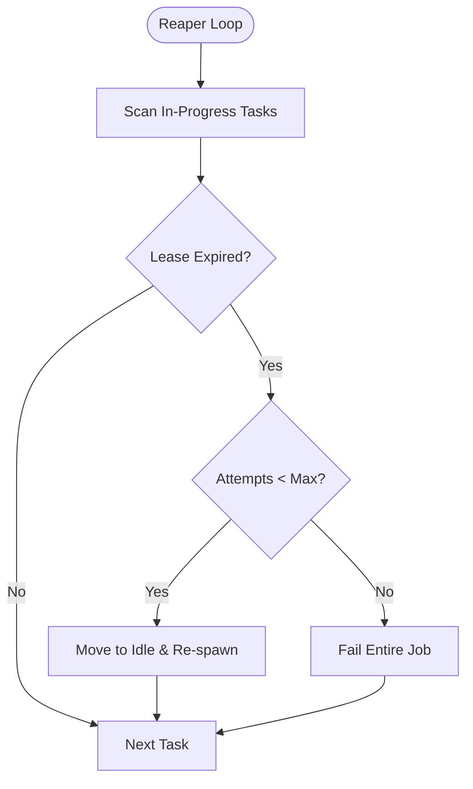

# manager

> Core scheduling and orchestration logic for KubeMapReduce jobs.

## Why This Package Exists
The MapReduce Manager is the brain of the cluster. Without it, work would not be distributed, and there would be no way to coordinate the complex Map-then-Reduce phase sequencing. This package ensures that if a worker fails, its task is automatically rescheduled, and that "zombie" workers cannot corrupt the output of a job.

## Architecture

The following flowchart shows the high-level logic used in `GetNextTask` to assign work while enforcing phase barriers and resource quotas.



The "Active Reaper" (`FailStaleTasks`) runs as a background loop to reclaim tasks from workers that have stopped heartbeating.



## Key Concepts

### Lease-Based Fencing
When a worker is assigned a task, it receives an `attempt_id` and a `lease_id`.
- The `attempt_id` is a unique identifier for that specific try. It must be sent with every RPC (`Heartbeat`, `TaskComplete`). The Manager will reject any RPC where the `attempt_id` does not match the `current_attempt_id` in the DDS.
- The `lease_id` is a secondary token that must match the `lease_id` stored for that specific attempt. It is refreshed during every `Heartbeat`.

### State Transitions
Tasks follow a strict linear progression: `Idle` → `InProgress` → `Completed` (or back to `Idle` on failure). These transitions are guarded by atomic database transactions that lock the task row (`FOR UPDATE`), preventing race conditions between concurrent Managers or a Manager and a Worker.

### Manager Partitioning
In a multi-replica deployment, each Manager instance is responsible for a subset of the jobs based on a hash of the `jobID`. This ensures that a single Manager instance owns the lifecycle of a job, simplifying the logic for phase transitions and cleanup.

## Exported API

| Function/Type | Signature | Description |
|---|---|---|
| `Scheduler` | `struct` | Central coordinator for job and task lifecycles. |
| `NewScheduler` | `func(...) (*Scheduler, error)` | Initializes a new scheduler with a DB connection and orchestrator. |
| `GetNextTask` | `func(...) (*Task, error)` | Atomically assigns the next available task to a worker. |
| `CompleteTask` | `func(...) error` | Marks a task as successfully completed and persists output URIs. |
| `FailTask` | `func(...) error` | Signals a task failure and triggers a retry or job-wide failure. |
| `RenewLease` | `func(...) error` | Extends a task's validity window based on a worker's heartbeat. |
| `FailStaleTasks` | `func(...) (int, error)` | Reclaims tasks from workers that have stopped heartbeating. |

## Error Catalogue

| Error | Meaning |
|---|---|
| `ErrNoIdleTasks` | All tasks for the current phase are already assigned. |
| `ErrStaleAttempt` | A worker tried to commit/heartbeat for an attempt that is no longer current. |
| `ErrExpiredLease` | The worker's lease has timed out in the DDS. |
| `ErrQuotaExceeded` | The cluster has reached the maximum allowed concurrent pods. |
| `ErrJobFailed` | One or more tasks reached the maximum retry attempts. |

## Example Usage

```go
// Initialize a scheduler
orchestrator := manager.NewKubeOrchestrator(clientset, "mapreduce", "worker:latest")
scheduler, _ := manager.NewScheduler(db, 0, 1, orchestrator, "manager:50051", 30)

// Periodically run the Active Reaper in the background
go func() {
    for {
        count, _ := scheduler.FailStaleTasks(context.Background())
        if count > 0 {
            log.Printf("Reclaimed %d stale tasks", count)
        }
        time.Sleep(10 * time.Second)
    }
}()

// Assign a task to a worker
task, err := scheduler.GetNextTask(ctx, jobID, workerID)
if err != nil {
    // Handle error (e.g., ErrNoIdleTasks or ErrJobCompleted)
}
```
