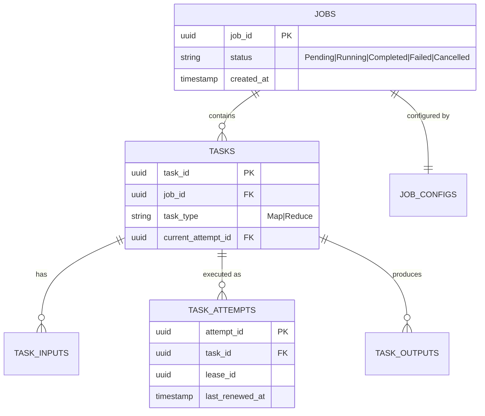

# models

> Central data structures and Distributed Data Store (DDS) schemas.

## Why This Package Exists
The `models` package acts as the "lingua franca" of the KubeMapReduce system. Without it, the Manager, Workers, and API would have disparate views of what a "Job" or "Task" is, leading to marshalling errors and database inconsistencies. It provides the strong typing required to safely pass state across gRPC and REST boundaries.

## Architecture


## Key Concepts

### Distributed Data Store (DDS) Mapping
Most types in this package include `db` tags, indicating a direct 1:1 mapping with a PostgreSQL table. This ensures that the code's view of the world is perfectly aligned with the persistent state stored in the DDS.

### Status Enumerations
The package defines several `string`-based types (`JobStatus`, `TaskStatus`, `AttemptStatus`) to represent state machines. Using custom types instead of raw strings prevents accidental state transitions and enables compile-time checking of valid states.

### Fencing via current_attempt_id
The `Task` struct's `CurrentAttemptID` field is the cornerstone of the system's "fencing" strategy. By only accepting results from the attempt that matches this ID, the system prevents "zombie" workers from corrupting data.

## Exported API

| Type/Func | Description |
|---|---|
| `Job` | Root entity for a MapReduce workflow. |
| `Task` | A single unit of work (Map or Reduce partition). |
| `TaskAttempt` | Represents one execution instance of a Task. |
| `JobSubmissionRequest` | API payload for submitting new jobs. |
| `IsTerminal()` | Helper to check if a job has finished (Success/Fail/Cancel). |

## Error Catalogue
This package is data-only and does not return errors. Validation logic is located in the `internal/validation` package.

## Example Usage
```go
import "github.com/google/uuid"
import "KubeMapReduce/manager-service/internal/models"

// Creating a new job model for insertion into the DDS
job := models.Job{
    JobID:  uuid.New(),
    UserID: userID,
    Status: models.JobPending,
}

if job.IsTerminal() {
    // This won't happen for a new job, but illustrates the helper
}
```
