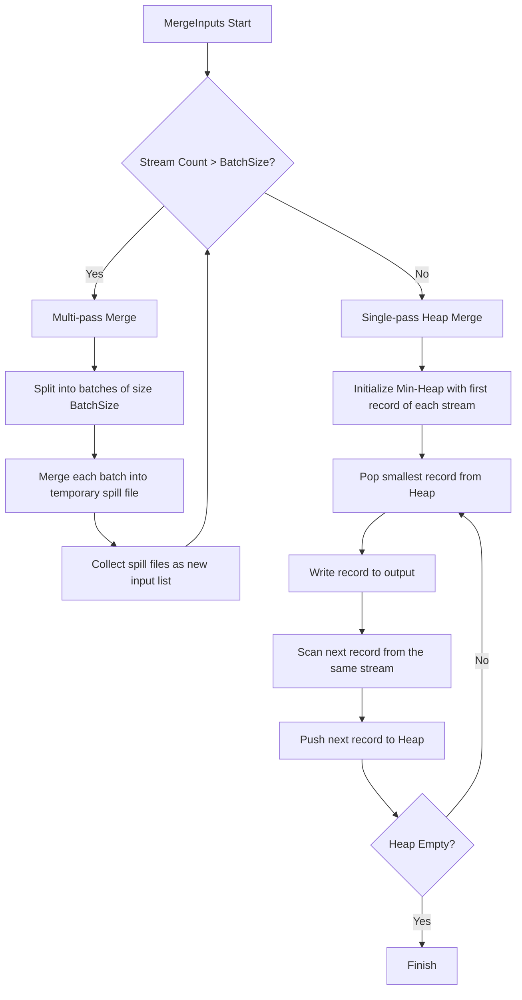

# Shuffle

> High-performance k-way merge sort for intermediate MapReduce data.

## Why This Package Exists
In a distributed MapReduce system, individual Mapper tasks produce sorted fragments of data. A Reducer task, however, requires a single, globally sorted stream of all records assigned to its partition. 

The `shuffle` package solves the "Shuffle" problem: aggregating hundreds or thousands of sorted JSONL files into one stream without exhausting the Manager's memory or file descriptor limits. It ensures that the Reducer receives data in a strictly deterministic, sorted order, which is an invariant required for the Reduce function to operate correctly on keyed groups.

## Architecture
The following flowchart describes the multi-pass external merge logic used to handle datasets larger than RAM and stream counts larger than the system's file descriptor limit.



## Key Concepts

### External K-Way Merge
Standard merge sort works in memory. External merge sort spills intermediate results to disk. This package uses a `container/heap` based min-heap to always pick the smallest key across all open streams, ensuring $O(N \log K)$ performance where $N$ is total records and $K$ is the number of streams.

### Multi-Pass Spilling
To prevent `EMFILE` (Too many open files) errors, the package implements recursive spilling. If you try to merge 2000 files but the `BatchSize` is 500, it will perform 4 merges of 500 files each, creating 4 intermediate "spill" files, and then merge those 4 files in a final pass.

### Stable Merging
By tracking the `index` of the input stream in the heap, the package ensures that if two records have identical keys, they are emitted in the order of the input streams, maintaining stability.

## Exported API

### `MergeInputs(readers []io.Reader, w io.Writer, cfg MergeConfig) (MergeStats, error)`
The primary entry point. It orchestrates the entire merge process, handling both single-pass optimizations and multi-pass recursive spilling.

### `MergeConfig`
Tunables for the merge operation.
- `BatchSize`: Maximum concurrent open files (default 500).
- `TempDir`: Location for intermediate spill files.

### `Record`
The data contract. Each record must be a JSON object with `key` and `value` strings.

## Error Catalogue

| Error | Meaning | Recovery |
|---|---|---|
| `failed to create spill file` | Disk full or permissions issue in `TempDir`. | Check disk space and `MergeConfig.TempDir`. |
| `malformed JSON in stream` | A Mapper produced invalid JSONL. | Check Mapper output logic; data is corrupted. |
| `failed to encode output` | The output writer (e.g., a network stream or file) failed. | Check Reducer availability or disk health. |

## Example Usage

```go
cfg := shuffle.DefaultMergeConfig()
stats, err := shuffle.MergeInputs(mapperOutputs, reducerInput, cfg)
if err != nil {
    log.Fatalf("Shuffle failed: %v", err)
}
fmt.Printf("Merged %d records in %d passes\n", stats.TotalRecords, stats.TotalPasses)
```
