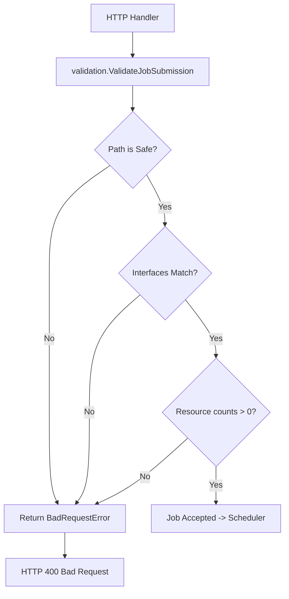

# Validation

> Request sanitization and system invariant enforcement.

## Why This Package Exists
Distributed systems are fragile when faced with malformed input. A single job submission with a path traversal string could compromise the Manager's filesystem, or a Reducer count of `-1` could crash the scheduler's logic.

The `validation` package acts as the system's "immune system." It ensures that every request entering the `manager-service` is checked against security rules (path sanitization) and operational rules (interface contracts) before any resources are committed.

## Architecture
The following flowchart shows how validation is integrated into the job submission lifecycle.



## Key Concepts

### Path Sanitization
The system uses `filepath.Clean` and manual checks to ensure that `filename` fields only contain simple base names. This prevents **Path Traversal** attacks, ensuring that a Worker or Manager can only ever read from or write to the designated `data/` or `output/` directories.

### Interface Contracts
KubeMapReduce supports multiple languages (Python, Java, C++). To ensure that a Mapper artifact written in Python can actually be called by the Worker, the `validation` package enforces a strict `interface` string match (e.g., `map(key,value)->[]KeyValue`).

### Error Classification
By wrapping validation failures in the `BadRequestError` type, the system distinguishes between "the user made a mistake" (400) and "the server failed" (500).

## Exported API

### `ValidateJobSubmission(req models.JobSubmissionRequest) error`
Validates a full MapReduce job. It checks paths, languages, artifacts, and resource requirements.

### `ValidateCreateUserRequest(req models.CreateUserRequest) error`
Validates user creation payloads, ensuring role canonicalization via `NormalizeRole`.

### `BadRequestError`
A specific error type that indicates a client-side validation failure.

## Error Catalogue

| Error | Meaning | Recovery |
|---|---|---|
| `filename is invalid` | The user attempted to use `..` or an absolute path. | Use a simple filename like `input.jsonl`. |
| `language must be one of...` | Unsupported runtime requested. | Choose from python, java, c, or cpp. |
| `interface must be...` | The artifact signature does not match the task type. | Correct the `interface` string in the job spec. |
| `reducers must be a positive integer` | Invalid resource count. | Request 1 or more Reducers. |

## Example Usage

```go
err := validation.ValidateJobSubmission(request)
if err != nil {
    if validation.IsBadRequest(err) {
        // Return 400 to user
        httputil.RespondWithError(w, http.StatusBadRequest, err.Error())
        return
    }
    // Return 500 to user
    httputil.RespondWithError(w, http.StatusInternalServerError, "Internal failure")
    return
}
```
